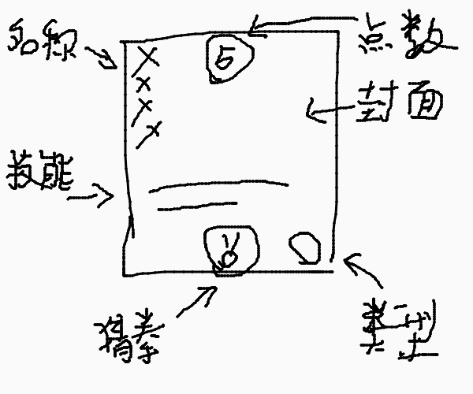

# 卡牌游戏规则设定

## 规则

~~游戏时间3分钟，~~开局将双方出战卡组混合打乱，每人发2张牌，丢硬币决定先手出牌，交替进行双方回合。

## 回合规则

每人每个回合有4个阶段，分为*判定阶段/召唤生效阶段*,*摸牌阶段*,*出牌阶段*,*结束阶段*。

### 判定阶段/召唤生效阶段

判定牌生效/已生效判定牌丢入弃牌堆,己方已部署的召唤牌逐一生效，已生效的召唤牌丢入弃牌堆里。

### 摸牌阶段

从牌堆摸取1张牌作为手牌。

### 出牌阶段

玩家可打出功能牌和部署召唤牌，同类型召唤牌只能部署一个，功能牌立即结算生效，召唤牌下回合(判定阶段/召唤生效阶段)生效，部署的召唤牌限制5个，回合时间为15秒，超时进入结束回合。

### 结束阶段

手牌数超过5张则需要弃牌，不足5张不能弃牌，弃牌放入弃牌堆，弃牌时间为10秒，超时随机弃牌。

## 游戏结果判定

游戏采取扣分制，开局时双方各有10点血，游戏时间内任一方血量降至0及以下时游戏结束，另一方获胜。

如果时间没到但牌已用完，血量多的一方获胜，若血量相同，则判为平局。

~~若时间到，血量多的一方获胜，若血量相同，则判为平局。~~

## 卡牌设定

卡牌类型分为*功能型*和*随从型*，功能型卡牌在当前回合立即生效，随从在下回合生效并且生效后立即丢弃。

一张卡牌有3个属性：效果、点数和权值。

效果可以是一种，也可以是特定条件下产生另一种。

点数是一个数字，从1到9。

权值是一个石头剪刀布的设定，受石头剪刀布的规则制约。

## 牌组设定

玩家游戏前需设定一个出战卡组，卡组由15张牌组成。

一个卡组的战斗值（即所有卡牌的点数和）要求在范围70到80之间。卡组的权值不作限制。

## 拼点规则

拼点使用手牌，发起人使用发起拼点的牌，被拼点的人如果没有手牌则判输。如果双方相同，判发起人胜利。

规则为石头->剪刀->布->石头。